# image processing concepts

## grayscale image 


## pixelated image 


## edge detection in the image 


this readme provides an in-depth explanation of fundamental image processing concepts, including how they are applied in the given javascript code. I will cover concepts such as grayscale conversion, edge detection, and pixelation, as well as the mathematical principles behind them.

## image representation

digital images are represented as a grid of pixels, where each pixel consists of three primary color channels: **red (r), green (g), and blue (b)**. each channel typically has a value between **0 and 255**, which determines the color intensity.

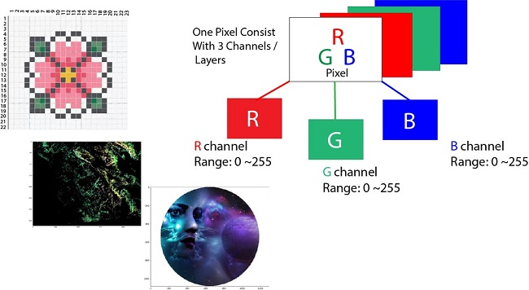
## concepts explained

# how a kernel determines whether an image will be sharpened or used for edge detection

## what is a kernel?

a **kernel** (also called a filter or mask) is a small matrix used in image processing to apply effects such as blurring, sharpening, and edge detection. it works by being **convolved** with the image, meaning each pixel in the output is calculated using the corresponding pixel and its neighbors in the input image, weighted by the kernel values.

## convolution operation

convolution is performed by sliding the kernel over the image, multiplying each value in the kernel with the corresponding pixel value, summing up the results, and placing the sum in the output image.

### mathematical formula:
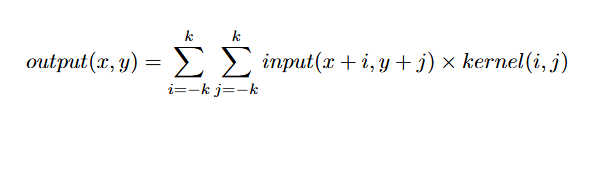

where:
- \( output(x, y) \) is the pixel value in the output image,
- \( input(x+i, y+j) \) is the pixel value from the input image,
- \( kernel(i, j) \) is the corresponding kernel value.

## how the kernel determines the effect

a kernel’s effect depends on the values inside the matrix. different values enhance different features of the image.

### 1. sharpening

to **sharpen** an image, the kernel enhances high-frequency details (edges and textures) by emphasizing the center pixel and subtracting neighboring values. a common sharpening kernel looks like this:


**how it works:**
- the center value (5) increases the intensity of the current pixel.
- the surrounding -1 values subtract neighboring pixel intensities, emphasizing differences.
- this enhances edges and fine details while keeping the original structure.

### 2. edge detection

to **detect edges**, kernels use derivatives to highlight areas where pixel intensity changes rapidly. sobel operators are commonly used:

#### sobel x kernel (detects vertical edges):

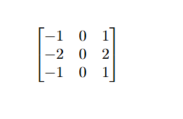

#### sobel y kernel (detects horizontal edges):

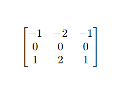

**how it works:**
- these kernels detect changes in intensity along a specific direction.
- the sobel x kernel finds vertical edges, and the sobel y kernel finds horizontal edges.
- edges appear where there is a significant intensity difference between adjacent pixels.

### 3. laplacian operator (detects edges in all directions)

the **laplacian operator** detects edges regardless of direction:

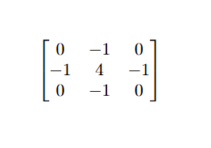

- this kernel detects edges in **all** directions by considering second-order derivatives.

## visual representation of a convolution

below is an illustration of how a convolution operation applies a kernel to an image:

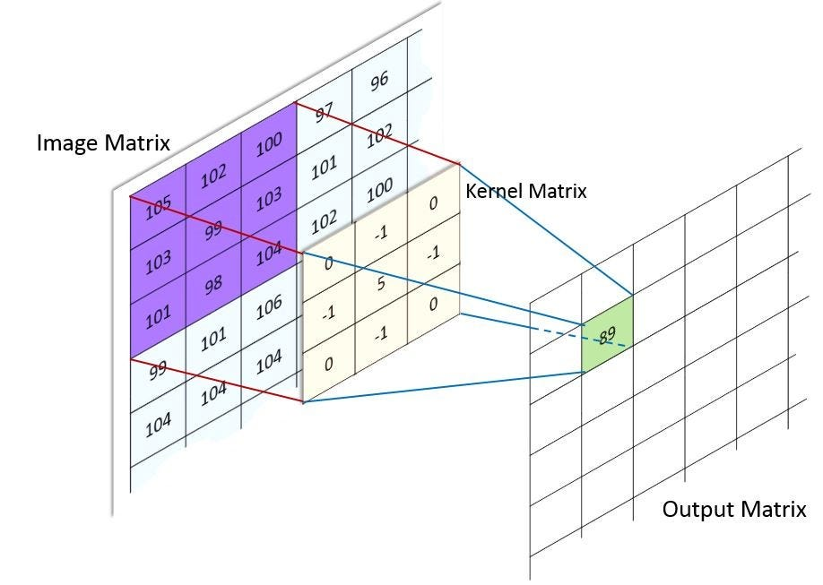

one more example to understand in depth 

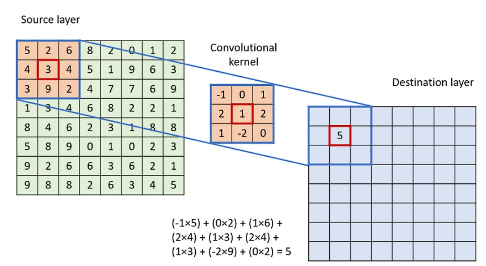

- the **image matrix** is the input image's pixel values.
- the **kernel matrix** is applied to a small region.
- the **output matrix ( destination matrix )** contains the transformed pixels.

## difference between sharpening and edge detection

| feature         | sharpening                           | edge detection                     |
|---------------|--------------------------------|--------------------------------|
| purpose        | enhances details & textures   | finds boundaries between objects |
| kernel sum    | positive (usually sums to 1)  | sums to 0 (detects differences) |
| effect        | keeps original colors         | turns edges into bright lines on a dark background |
| application   | used for clarity enhancement  | used for object detection and feature extraction |

## conclusion

- a **sharpening** kernel enhances fine details by boosting the center pixel and reducing surrounding ones.
- an **edge detection** kernel focuses on intensity differences and removes uniform regions.
- the sum of kernel values gives insight into the effect (positive for sharpening, zero for edge detection).

by adjusting the values in the kernel matrix, we can control the effect applied to an image.

---------------------
--------------
-----

### 1. grayscale conversion

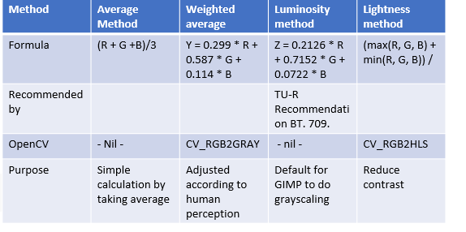


**concept:** grayscale conversion transforms a color image into shades of gray by removing color information while preserving brightness.

**mathematical formula:**
```
gray = (r + g + b) / 3
```

**code implementation:**
```js
case "grayscale":
    for (let i = 0; i < data.length; i += 4) {
        let avg = (data[i] + data[i + 1] + data[i + 2]) / 3;
        data[i] = data[i + 1] = data[i + 2] = avg;
    }
    break;
```

### 2. edge detection (sobel operator)

example:-

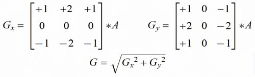

example 2 :-

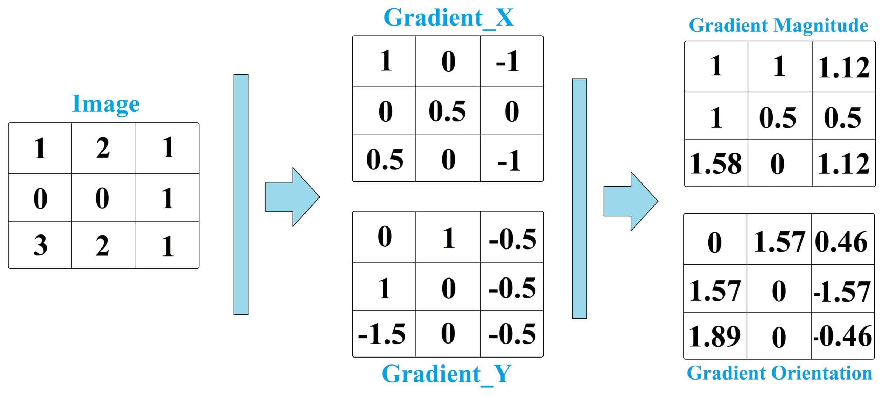

**concept:** edge detection highlights areas where pixel intensity changes rapidly, identifying object boundaries.

**mathematical formula (sobel operator):**
```
g_x = (-1, 0, 1) * i + (-2, 0, 2) * i + (-1, 0, 1) * i
g_y = (-1, -2, -1) * i + (0, 0, 0) * i + (1, 2, 1) * i
magnitude = sqrt(g_x^2 + g_y^2)  #squirt lol
```

**code implementation:**
```js
let sobelX = (-data[i - 4] + data[i + 4]) +
             (-2 * data[i - width * 4] + 2 * data[i + width * 4]) +
             (-data[i - width * 4 - 4] + data[i + width * 4 + 4]);

let sobelY = (-data[i - width * 4 - 4] + data[i - width * 4 + 4]) +
             (-2 * data[i - 4] + 2 * data[i + 4]) +
             (-data[i + width * 4 - 4] + data[i + width * 4 + 4]);

let magnitude = Math.sqrt(sobelX ** 2 + sobelY ** 2);
newData[i] = newData[i + 1] = newData[i + 2] = magnitude;
```

### 3. pixelation

**concept:** pixelation reduces the resolution of an image by grouping pixels into blocks and averaging their colors.

## Pixelation: A Mathematical Perspective

## 1. Introduction
Pixelation is the effect of displaying an image at a **low resolution**, where individual pixels become visible. It occurs when an image is scaled up without enough detail, leading to a blocky appearance.

## 2. Mathematical Representation

### 2.1 Image as a Discrete Function
An image can be represented as a **discrete 2D function**:

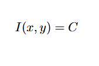

where:
- \( I(x, y) \) is the intensity (color) at pixel \( (x, y) \),
- \( C \) is the RGB or grayscale value.

### 2.2 Downsampling (Cause of Pixelation)
Pixelation often results from **downsampling**, where an image is reduced in size by averaging groups of pixels.

If an original image has resolution W * H and is downsampled by a factor of S, the new resolution is:

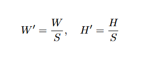

Each new pixel at \( (i, j) \) is computed as:

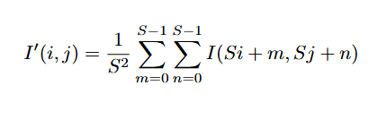

where:
- \( S \) is the sampling factor (block size),
- \( I'(i, j) \) is the new pixel value,
- The summation averages the color values in each \( S \times S \) block.

### 2.3 Upsampling (Pixelation Effect)
When an image is **scaled up** without interpolation, pixel blocks expand. If we scale by a factor S, each pixel is replaced by an S*S block:

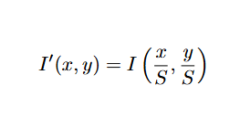

This results in a blocky structure, since no new detail is introduced.

## 3. Visual Example
Consider a 4 * 4 image:


**mathematical concept:**
- select a block size (`pixelSize`).
- replace all pixels in the block with the color of the top-left pixel.

**code implementation:**
```js
let pixelSize = 10;
for (let y = 0; y < imageData.height; y += pixelSize) {
    for (let x = 0; x < imageData.width; x += pixelSize) {
        let i = (y * imageData.width + x) * 4;
        let red = data[i], green = data[i + 1], blue = data[i + 2];
        
        for (let dy = 0; dy < pixelSize && (y + dy) < imageData.height; dy++) {
            for (let dx = 0; dx < pixelSize && (x + dx) < imageData.width; dx++) {
                let pixelIndex = ((y + dy) * imageData.width + (x + dx)) * 4;
                data[pixelIndex] = red;
                data[pixelIndex + 1] = green;
                data[pixelIndex + 2] = blue;
                data[pixelIndex + 3] = 255;
            }
        }
    }
}
```

## how image processing works in the code

1. **loading the image:**
   - `main.js` reads an image file from user input.
   - the image is drawn on a `<canvas>` element.
   - `getImageData` retrieves pixel data for processing.

2. **processing with web workers:**
   - a web worker (`worker.js`) processes the image in a separate thread.
   - this prevents ui freezing during heavy computations.

3. **applying filters:**
   - the filter type is sent to `worker.js`.
   - the worker applies the selected filter and returns modified pixel data.
   - the `main.js` script updates the canvas with the processed image.


---


